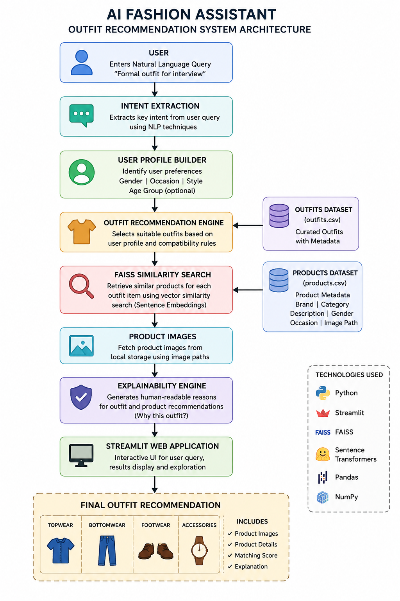

# AI Fashion Assistant

AI-powered Fashion Outfit Recommendation System developed for the Dare XAI Machine Learning & AI Engineer Internship Assignment.

---

# Overview

This project builds an intelligent fashion recommendation system capable of understanding user requirements and generating complete outfit suggestions based on:

- Gender
- Occasion
- Style Preferences
- Fashion Metadata
- Product Compatibility
- Semantic Similarity Search

The system provides complete outfit recommendations including:

- Topwear
- Bottomwear
- Footwear
- Accessories

along with explainable reasoning.

---

# Features

- Conversational Outfit Recommendations
- User Profile Understanding
- Occasion Detection
- Outfit Compatibility Matching
- Product Image Retrieval
- Explainable Recommendations
- FAISS Vector Search
- Semantic Fashion Retrieval
- Streamlit Web Interface

---

# Tech Stack

- Python
- Streamlit
- Pandas
- NumPy
- FAISS
- Sentence Transformers
- Fashion Metadata Filtering

---

# Dataset

Dataset provided as part of the Dare XAI Fashion Recommendation Assignment.

Dataset contains:

- 68 Fashion Products
- Multiple Categories
- Product Metadata
- Product Images
- Occasion Information
- Gender Information

---

# Setup Instructions

## 1. Clone the Repository

```bash
git clone https://github.com/Loukhya/ai-fashion-assistant.git
```

## 2. Navigate to Project Folder

```bash
cd ai-fashion-assistant
```

## 3. Install Dependencies

```bash
pip install -r requirements.txt
```

## 4. Run the Application

```bash
streamlit run app.py
```

---

# Project Structure

```text
AI-Fashion-Assistant
│
├── app.py
├── products.csv
├── outfits.csv
├── dataset_analysis.py
├── compatibility_engine.py
├── smart_outfit_generator.py
├── faiss_engine.py
├── semantic_search.py
├── architecture.png
├── requirements.txt
├── README.md
└── images/
```

---

# Architecture Explanation

The AI Fashion Assistant follows a hybrid recommendation approach combining metadata filtering, semantic retrieval, and outfit compatibility logic.

## Workflow

### Step 1: User Query

User enters a natural language fashion request.

Example:

```text
I am a 22 year old male looking for a formal outfit for an interview
```

### Step 2: User Understanding

The system extracts:

- Gender
- Occasion
- Style Preferences

### Step 3: Semantic Embeddings

Fashion product information is converted into vector embeddings using:

- Sentence Transformers
- all-MiniLM-L6-v2 model

### Step 4: FAISS Vector Search

The generated embeddings are indexed using FAISS.

This allows semantic retrieval of relevant fashion products based on user intent.

### Step 5: Outfit Compatibility Engine

Compatible fashion items are selected for:

- Topwear
- Bottomwear
- Footwear
- Accessories

using category-based compatibility rules.

### Step 6: Explainability Module

The system generates reasoning explaining why the outfit was recommended.

### Step 7: Streamlit Interface

The final outfit recommendation is displayed with:

- Product Images
- Outfit Components
- Recommendation Reasoning

---

# Architecture Flow

```text
User Query
        ↓
User Understanding
        ↓
Semantic Embeddings
        ↓
FAISS Vector Search
        ↓
Outfit Compatibility Engine
        ↓
Explainability Module
        ↓
Streamlit UI
```

---

# System Architecture Diagram



---

# Example Query

```text
I am a 22 year old male looking for a formal outfit for an interview
```

Recommended Output:

- Formal Shirt
- Formal Trousers
- Formal Shoes
- Watch

with detailed reasoning.

---

# Advanced Retrieval Features

The system incorporates:

- Sentence Transformer Embeddings
- FAISS Vector Search
- Semantic Product Retrieval

### Embedding Model

- all-MiniLM-L6-v2

### Vector Search Engine

- FAISS IndexFlatL2

### Retrieval Workflow

1. Fashion products are converted into embeddings.
2. Embeddings are stored in a FAISS index.
3. User queries are converted into embeddings.
4. Similar fashion products are retrieved using vector similarity search.
5. Retrieved products are used by the recommendation engine.

---

# Future Improvements

- FashionCLIP Integration
- CLIP Image Embeddings
- Gemini-powered Intent Extraction
- Multi-modal Retrieval
- RAG Pipelines
- Personalized Fashion Recommendations
- Hybrid Recommendation Engine
- Graph-based Outfit Compatibility

---

# Assignment Deliverables

Included in this repository:

- Source Code
- Dataset Analysis
- Outfit Compatibility Engine
- Semantic Search using FAISS
- Architecture Diagram
- Technical Documentation
- Streamlit Prototype
- README
- Setup Instructions

---

# Author

Loukhya Y

Dare XAI Machine Learning & AI Engineer Internship Assignment Submission